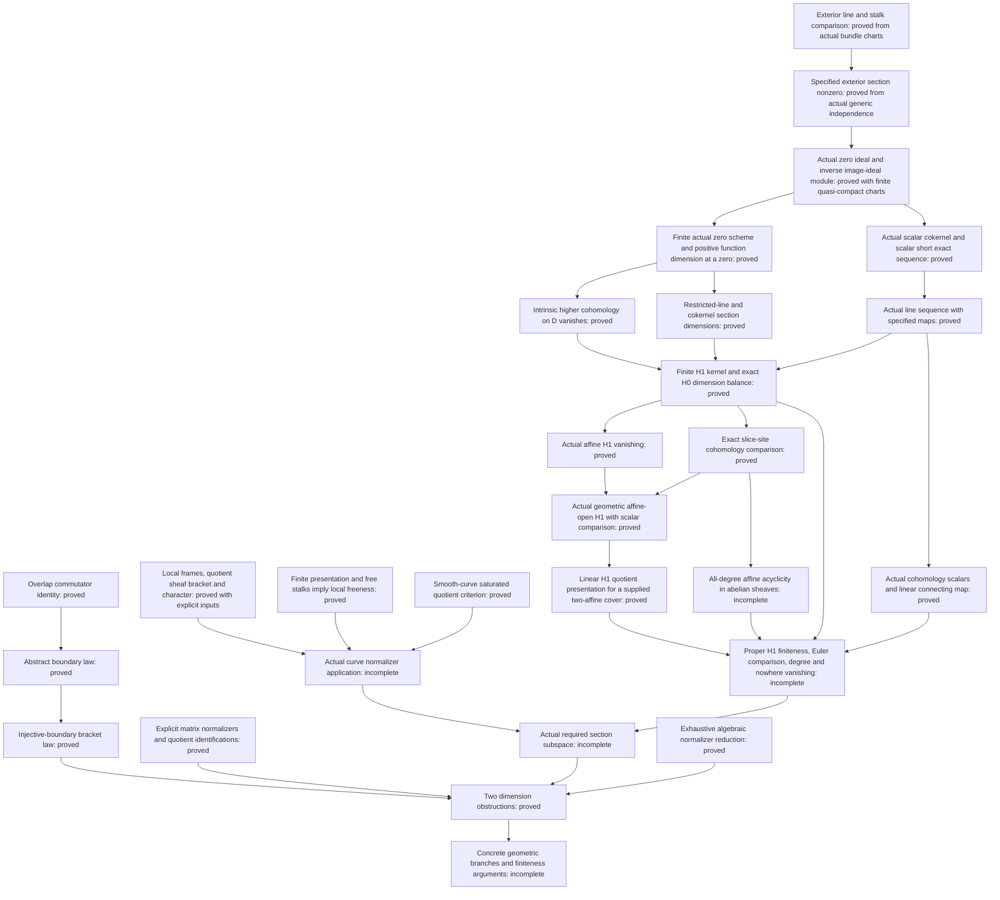

# Mathematical scope and proof dependencies

The formalized obstruction is a local algebraic endpoint of a proposed
geometric argument. The package also supplies general sheaf constructions
needed to connect the curve to that endpoint. Each theorem retains its
actual hypotheses; the missing geometric interfaces are not axioms.

## The algebraic obstruction

The scalar-action character is defined by `[x,m] = λ(x)m`. On overlaps,
the commutator of two lifts has the difference required for

```text
∂[x,y] = λ(x)∂y − λ(y)∂x.
```

When the relevant linear boundary map is injective, this implies
`[x,y] = λ(x)y − λ(y)x`. The abstract proof does not construct a curve's
cohomology connecting map.

For the semisimple representative `diag(1,1,−2)`, the quotient character
vanishes and the quotient is the `sl₂` model. A three-dimensional subspace
would be the whole quotient, but the boundary law would force all of its
brackets to vanish.

For the minimal-nilpotent representative `E₁₂`, the quotient has coordinates
`D,H,P,Q`. The law forces specific two-by-two coordinate minors to vanish.
Case analysis gives an injective projection to two coordinates, hence
dimension at most two. This proof obtains the obstruction directly; it
does not export a classification of all abelian planes.

`Matrices.lean` proves the normalizer equations in both directions.
`Quotients.lean` proves that the coordinate projections have exactly the
distinguished line as kernel and preserve commutators. Thus the coordinate
models are identified with the actual matrix quotients.

The later `TracelessNormalizer` and `MatrixScalarExtension` results prove
exhaustive algebraic reduction and the obstruction for all nonzero traceless
3×3 matrices over characteristic-zero fields under their exact
boundary-lift hypotheses. The geometric construction of that boundary law
and its required section subspace is separate.

## How the parts fit



Arrows to an incomplete node identify work still required, rather than a
completed Lean composition. The following module groups supply the pieces:

| Modules | Proven role |
|---|---|
| `Boundary`, `HomologyBoundary`, `SheafBoundary` | Overlap identity, abstract homology connecting maps, and direct sheaf gluing under explicit vanishing hypotheses. |
| `Matrices`, `Quotients`, `SlTwo`, `Obstruction`, `Flagship` | Exact normalizers, actual quotient models, and the two dimension contradictions. |
| `ExtensionNaturality`, `ExtensionDimension` | Extension-map annihilation and linear dimension bounds with their stated inputs. |
| `FrameCharacter`, `LocalCharacterGluing`, `NormalizerSheaf`, `TrivializedCharacter` | Frame-independent character and normalizer constructions. |
| `SheafQuotientBracket`, `SheafQuotientLie`, `NormalizerKernel`, `NormalizerTensorKernel` and their support modules | Genuine local quotient lifts, descended Lie operations, and the kernel identification, including its tensor target. |
| `AffineQuotient`, `IntegralSheafTorsion` and the stalk/neighborhood modules | Affine quotient comparison, torsion-freeness transport, and finite free neighborhoods. |
| `LocallyFreeAssembly`, `StalkLocalFreeness` | Assembly into `IsLocallyFree` and the regular dimension-at-most-one torsion-free criterion. |
| `SheafCokernelFinitePresentation`, `FiniteBundlePresentation`, `SaturatedStalkQuotient`, `SmoothSchemeStalks` | Actual cokernel finite presentation, finite presentation from finite bundle charts, saturation and smooth-stalk regularity give the smooth-curve quotient criterion. |
| `ProperConstants`, `ScalarCharacter`, `ProperNormalizerCharacter` | Constancy of actual global regular functions under the stated properness or universal-closedness inputs, with actual scalar-character compatibility. |
| `NormalizerStalkIntegration`, `GeometricNormalizerObstruction` | Actual quotient-stalk bracket and character comparison; the generic obstruction under an actual ambient sl3 identification and its compatibility. |
| `ExteriorLineTrivialization`, `LocalFrameStalk`, `ExteriorStalkComparison` | Genuine bundle charts construct exterior-line charts, actual stalk bases and the canonical exterior-stalk equivalence with its pure-germ formula. |
| `ExteriorNonzero`, `DeterminantGenericNonzero` | Actual generic independence proves the specified exterior section has nonzero generic germ and is globally nonzero. |
| `SectionLocalEquation`, `SectionDualEvaluation`, `SectionEvaluationMono`, `SectionZeroDivisor` | Actual local equations and dual evaluation; generic nonzeroness proves regularity and monicity. |
| `SectionZeroIdeal`, `IdealSheafGluing`, `SectionZeroScheme`, `ZeroIdealUniqueness` | Actual global zero ideal and closed subscheme from finite quasi-compact charts, with exact chart restrictions and cover independence. |
| `SectionImageSheaf`, `DualTransport`, `LineBidual`, `SectionIdealBundle` | Actual image ideal module, its dual and canonical bidual comparison; the inverse module recovers the original line and specified section. |
| `DeterminantZeroDivisor` | Specialization to the actual specified determinant; exterior and dual charts are constructed from the original rank-n bundle charts. |
| `LineGenericInjection`, `FiniteLineCharts` | Integral geometry and genuine pointwise line charts give global-to-generic injection; compactness and Noetherianity extract finite quasi-compact charts. |
| `CurveClosedSubscheme`, `FiniteZeroDimensional`, `SectionZeroSupport` | Generic-point exclusion for the actual zero scheme, dimension at most zero, and finiteness of the actual structure morphism. |
| `SectionZeroLocus`, `FiniteSchemeSections`, `SectionZeroFinite` | Actual support detects nonunit local equations. A zero of the specified section gives positive dimension of the actual finite zero-scheme global function space, including the determinant specialization. |
| `ClosedSubschemeModules`, `SectionZeroIdealAffine`, `SheafCokernelComparison`, `SectionZeroCokernel` | Actual affine ideal/image equality, closed-subscheme structure map, stalk surjectivity and exactness assemble the canonical scalar sheaf-cokernel isomorphism. |
| `SectionZeroExact`, `SectionHomMono` | Actual scalar short exact sequence for a nonzero line section, including the determinant specialization; separately, monicity of the actual section map O_X -> L. |
| `LineRestrictionComparison`, `LineRestrictionUnit`, `PullbackRestrictionUnit`, `LineRestrictionCompatibility` | The complete actual pullback/restriction square and line-chart diagram commute with the specified maps. |
| `SectionLineExact` | Actual line cokernel and short exact sequence, preserving the section and restriction maps; determinant and proper-scheme pointwise-chart specializations. |
| `DiscreteSheafCohomology`, `FiniteSchemeCohomology` | Intrinsic higher-cohomology vanishing for actual abelian sheaves on discrete spaces and on the constructed finite zero scheme. |
| `AbelianSheafPullbackExact`, `ClosedPushforwardExact`, `ConstantSheafPullback`, `ClosedPushforwardCohomology` | Actual exact abelian-sheaf adjoints and constant-sheaf comparison give the natural cohomology equivalence for closed embeddings, including the actual degree-zero global-section formula. |
| `ModuleAbelianPushforward`, `SectionCokernelCohomology` | Actual module/abelian pushforward compatibility transports intrinsic vanishing to the actual line-section cokernel on the proper integral curve; the determinant case is constructed from pointwise bundle charts. |
| `SectionCohomologyExact` | The actual section sequence remains short exact as abelian sheaves; its extension class supplies the canonical connecting map and exact H⁰-to-H¹ segment, including injectivity at the first H⁰ term and surjectivity onto H¹(L) on the finite-type integral curve. |
| `DiscreteLineTrivialization`, `FiniteLineSections` | Actual pointwise charts construct a global line trivialization on finite schemes, with nilpotents retained; actual sections are finite and have the global-function dimension. |
| `ModulePushforwardSections`, `SectionCokernelSections` | Actual base-field pushforward and H⁰ comparisons give the section cokernel the zero-scheme function dimension. Its cohomology is finite in every degree; a zero gives positive H⁰ dimension. |
| `ModuleSheafCohomologyScalars`, `SectionCohomologyLinear` | Actual scalar endomorphisms induce field actions on cohomology; all induced maps and the original connecting map are linear. |
| `ProperLineSectionsFinite` | Genuine pointwise line charts on a proper integral curve over an algebraically closed field give finite-dimensional sections and actual H⁰, without assuming a nonzero section or H¹ finiteness. |
| `OverAbelianExtension`, `OverSheafCohomology` | Constructed exact adjoints give the natural additive comparison of actual cohomology-presheaf evaluation with actual slice-site cohomology, with degree-zero generator evaluation. |
| `SectionCohomologyDimension` | Actual finite H¹ kernel, equivalence of H¹ finiteness, and exact H⁰/kernel dimension balance without either absolute H¹ finiteness assumption. |
| `AffinePrincipalLocalization`, `AffineCechOne` | Actual principal-open restriction is module localization; every degree-one cocycle on a finite principal cover is a coboundary by two denominator clearings. |
| `AffineSheafLifting`, `AffineH1Vanishing` | Arbitrary abelian-sheaf extensions with a localizing kernel are surjective on global sections. The canonical injective presentation gives actual H¹(Spec R, tilde M) = 0 for all rings and modules, and the quasicoherent-sheaf corollary. |
| `SheafCohomologyTerminal` | Natural general-site H' at a terminal object versus actual H comparison, with degree-zero identity-generator evaluation. |

## Remaining geometric interfaces

1. **Actual curve input.** Instantiate the proved smooth-curve saturated
   quotient criterion on the actual representation-derived Lie bundle and
   saturated line. Finite presentation from genuine finite bundle charts,
   actual cokernel finite presentation, smooth-stalk regularity and
   saturation-to-torsion-freeness are now proved. No affine PID cover of
   a smooth curve is assumed.
2. **Curve normalizer.** Instantiate the Lie bundle, saturated line and
   local frames. Global-function constancy and its actual character
   compatibility are now proved under the stated geometric inputs.
   The proved local-freeness theorem for the
   quotient by a kernel does not automatically give local freeness of the
   kernel itself.
3. **Global boundary law.** In the `H⁰(E)=0` applications, the direct
   gluing theorem provides a route once the geometric inputs are supplied.
   The alternative general injective-boundary route requires the actual
   connecting map and its Čech comparison. These are different routes;
   neither may assume its desired bracket identity.
4. **Required generic section subspace.** Actual generic evaluation,
   scalar extension, bracket/character compatibility and exhaustive
   algebraic reduction are proved. Dimension preservation is proved given
   an actual free inclusion or trivialized subsheaf. Constructing
   that input from the curve's specified sections remains unfinished.
   The constructed exterior line and stalk comparison prove the specified
   determinant section nonzero from actual function-field independence.
   They do not prove it nonvanishing at every point.
5. **Finiteness.** Supply the concrete extensions, section estimates,
   Harder–Narasimhan and boundary inputs for the genus-five branches, then
   the family, Hodge-theoretic, arithmetic and propagation arguments for
   the claimed representations, including nonsemisimple ones.

The zero-subscheme and inverse image-ideal module constructions are now proved
under their explicit finite quasi-compact chart and integral-scheme inputs.
The section-preserving comparison concerns the actual specified section.
Finiteness of this actual zero scheme over the field is now proved on a
proper integral curve. Genuine pointwise charts yield the finite
quasi-compact cover, and global section nonzeroness yields generic
nonzeroness. A zero gives positive dimension of the actual zero-scheme
global functions. The actual scalar sequence
`0 -> L-dual -> O_X -> i_*O_D -> 0` is now short exact, with its actual maps.
The actual line sequence
`0 -> O_X --s--> L -> i_*(L restricted to D) -> 0` is also proved short exact,
with the original adjunction unit as restriction map. Intrinsic higher
cohomology on D vanishes. The actual closed-pushforward comparison now
transports it to the actual cokernel on X, naturally and compatibly with
global sections in degree zero. The rank-one dimension comparison on D is
now proved by gluing genuine line charts on its discrete underlying space;
nilpotents are retained. The actual cokernel and its H⁰ are linearly equivalent
to Gamma(D,O_D), and a zero of the specified section gives positive dimension.
Actual cohomology scalars and linearity of the connecting map are constructed.
For an algebraically closed base, genuine pointwise line charts on the proper
integral curve now prove finite-dimensional sections and H⁰ without supplying
a nonzero section. The actual H¹ section map now has finite kernel, and the
finite-term H⁰/kernel dimension balance is proved. Actual affine H¹ vanishing
is now proved for all associated sheaves and quasicoherent module sheaves on
Spec R and every affine open of an ambient scheme. The actual geometric
open comparison is linear for the structure-field actions. A supplied
two-affine cover now gives the actual linear quotient presentation of H1;
its boundary kernel is exactly the restriction differences. Proper-curve H¹(O_X) finiteness, the remaining curve vanishing and
Euler additivity must still connect established line degree to that dimension, as needed
for [Stacks Lemma 33.44.12(2)](https://stacks.math.columbia.edu/tag/0B40).
No general bundled effective-Cartier-divisor/O(D) interface is claimed.
The [precise gap note](DEGREE_NONVANISHING_GAP.md) distinguishes this concrete
construction from the missing Euler-characteristic comparison and
line-degree positivity. These missing results have not been assumed as new
hypotheses in the proofs.
The actual saturated evaluation subbundle and its degree zero, the rank-two
section estimate, and the complete bound `h⁰(E/M) ≤ 4` remain unformalized.

## Claim boundary

| Statement | Status |
|---|---|
| Listed Lean theorems with their displayed hypotheses | **FORMALIZED** |
| Complete normalizer proposition for the actual curve | **PARTIAL formalization** |
| Landesman–Litt strict range `r < sqrt(g+1)` | **PUBLISHED**; not formalized by this package |
| Equality endpoint `r² ≤ g+1` | **CANDIDATE** |
| Rank three for `g ≥ 5` | **CANDIDATE** |
| Rank three in genus four | **CANDIDATE conditional on B1–B5** |
| Rank three in genus three; general `g ≥ r²−4` | **OPEN** |

A successful build checks the stated formal propositions. It does not
establish missing geometric hypotheses, independent mathematical review,
or a complete solution of the minimum-rank problem.

## Current finite-map route

`LaurentCechFinite` constructs a finite spanning window for the quotient
by nonnegative and nonpositive power spans of Laurent-generating families.
`CurveFiniteMap` derives finiteness of an actual nonconstant morphism from
a proper integral curve to a separated k-scheme by proving its fibres finite.
`CurveRationalExtension` now constructs the unique global extension on the
normal-curve branch. `ProjectiveLine` supplies the actual Proj target and
charts. `CurveProjectiveLine` extends the map of a specified rational
function, preserving its base and generic restriction; it does not prove
nonconstancy itself. CurveMapExistence now constructs a suitable function
and proves nonconstancy on the normal branch; CurveMapSingular also permits
one exceptional point. For finite maps the earlier module constructs finite
actual chart modules.
`TwoAffineSections` identifies actual overlap sections modulo actual
restriction differences with H1, preserving the field action.

`ProjectiveCoordinates` now identifies the actual section rings of both
standard Proj charts with polynomial rings and the actual overlap section
ring with Laurent polynomials, over every commutative coefficient ring.
The first actual restriction is polynomial inclusion; the second sends its
variable to the inverse Laurent variable. This is proved from the actual
homogeneous-localization maps and mathlib's actual Proj sheaf restrictions.
The coordinate maps fix the homogeneous-localization constants.

`ProjectiveLineCohomology` then proves actual H1(P1_k,O)=0 over every field.
Every Laurent polynomial splits into the difference of a polynomial in T
and a polynomial in T^-1. The actual section isomorphisms transport this
decomposition to actual chart sections. Consequently the actual
Mayer-Vietoris boundary is zero; affine-open vanishing makes it surjective.
No cohomology vanishing or finite-dimensionality is supplied as a hypothesis.
Finiteness for the actual structure-field action follows from vanishing.
This is the n=1, d=0, q=1 field-base case of
[Stacks Lemma 30.8.1](https://stacks.math.columbia.edu/tag/01XS).

The finite-map comparison is now constructed. `FiniteChartGeometry`
identifies each actual pulled-back overlap as the principal open of the
actual pulled-back chart ratio, and proves the section restriction is the
corresponding localization. `ProjectiveChartScalars` identifies actual
coordinate constants with those of the original structure morphism.

`FiniteMapLaurent` defines the Laurent action through f.app and proves the
coefficient action agrees with `schemeOpenSectionsModule` for the composed
structure map. The actual restriction is semilinear and its localization
clears denominators. `FiniteMapH1` chooses finite chart generators using
finiteness of the original morphism. Their restrictions generate the actual
overlap over the Laurent ring. Each actual chart restriction image equals
the coefficient span of the corresponding nonnegative or nonpositive powers.
The actual Mayer-Vietoris boundary kills these two spans and is onto; the
proved Laurent quotient finiteness theorem gives finite-dimensional actual
H1(X,O_X). No cohomology dimension or quotient presentation is an input to
the final theorem.

`finiteMap_projectiveLine_unit_H1_finite` requires only an actual finite
f:X -> P1_k, with k a field. It requires no source integrality, normality,
smoothness or reducedness. `properCurve_unit_H1_finite_of_projectiveMap`
derives finiteness from a supplied nonconstant k-map to P1 on a proper
integral curve of dimension at most one, preserving the original p-scalars.
Neither theorem constructs the required map for an arbitrary proper curve.

The finite-map existence construction is now complete on three branches.
`properNormalCurve_exists_finite_projectiveLine` constructs the map on a
proper integral curve with integrally closed actual stalks and dimension
at most one. It supplies both the rational function and nonconstancy:
an affine neighborhood with two points has a section whose invertibility
locus is nonempty and proper. Its [1:s] map extends globally by the
valuative criterion and agrees on the whole original open. That preserves
nonconstancy; properness then makes the map finite. The zero-dimensional
branch is also proved, without integrality or reducedness, using [1:0].

`properSmoothCurve_exists_finite_projectiveLine` derives stalk normality
from smoothness and the dimension bound. The corresponding actual H1
finiteness theorem uses the original structure-field action; it assumes
no map, rational function, local normality or cohomology dimension.

`partialMap_extends_of_valuationOutside` requires valuation stalks only
outside the actual domain. Consequently a nontrivial affine open U whose
complement has integrally closed stalks suffices, even if U is singular.
`properCurve_exists_finite_projectiveLine_of_normalAwayPoint` constructs
such an affine open when the curve is normal away from one specified
point; no normality at that point is assumed. It also yields actual H1
finiteness. These are full results for their explicitly stated branches,
not the unrestricted proper integral curve theorem.

For the unchanged general target, the exact next sufficient lemma is:

```text
p:X -> Spec k proper, X integral, Nontrivial X, dim X <= 1
  => exists U : X.Opens,
       IsAffineOpen U and Nontrivial U and
       forall x not in U, IsIntegrallyClosed (O_X,x).
```

Neither the needed affine neighborhood of the entire nonnormal locus nor
the general normalization/finite-support defect/cohomology transfer is
constructed. Dimension zero is now closed. Normality has not been added
to the unrestricted target. Higher curve vanishing and Euler/degree
comparison remain separate. The normal and smooth H1 results can already
be used wherever their actual geometric hypotheses are established.

General proper integral curve H1 finiteness, higher curve vanishing and
Euler/degree comparison remain unproved. See the
[precise remaining construction](DEGREE_NONVANISHING_GAP.md).
