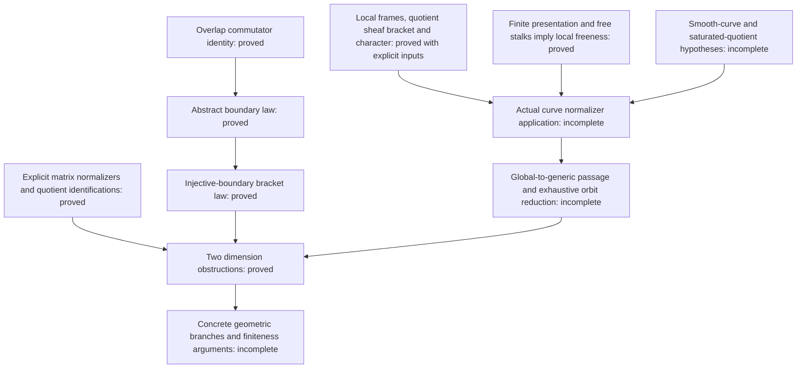

# Mathematical scope and proof dependencies

The formalized obstruction is a local algebraic endpoint of a proposed
geometric argument. The package also supplies general sheaf constructions
needed to connect the curve to that endpoint. Each theorem retains its
actual hypotheses; the missing geometric interfaces are not axioms.

## The algebraic obstruction

The scalar-action character is defined by `[x,m] = λ(x)m`. On overlaps,
the commutator of two lifts has the difference required for

```text
∂[x,y] = λ(x)∂y − λ(y)∂x.
```

When the relevant linear boundary map is injective, this implies
`[x,y] = λ(x)y − λ(y)x`. The abstract proof does not construct a curve's
cohomology connecting map.

For the semisimple representative `diag(1,1,−2)`, the quotient character
vanishes and the quotient is the `sl₂` model. A three-dimensional subspace
would be the whole quotient, but the boundary law would force all of its
brackets to vanish.

For the minimal-nilpotent representative `E₁₂`, the quotient has coordinates
`D,H,P,Q`. The law forces specific two-by-two coordinate minors to vanish.
Case analysis gives an injective projection to two coordinates, hence
dimension at most two. This proof obtains the obstruction directly; it
does not export a classification of all abelian planes.

`Matrices.lean` proves the normalizer equations in both directions.
`Quotients.lean` proves that the coordinate projections have exactly the
distinguished line as kernel and preserve commutators. Thus the coordinate
models are identified with the actual matrix quotients.

## How the parts fit



Arrows to an incomplete node identify work still required, rather than a
completed Lean composition. The following module groups supply the pieces:

| Modules | Proven role |
|---|---|
| `Boundary`, `HomologyBoundary`, `SheafBoundary` | Overlap identity, abstract homology connecting maps, and direct sheaf gluing under explicit vanishing hypotheses. |
| `Matrices`, `Quotients`, `SlTwo`, `Obstruction`, `Flagship` | Exact normalizers, actual quotient models, and the two dimension contradictions. |
| `ExtensionNaturality`, `ExtensionDimension` | Extension-map annihilation and linear dimension bounds with their stated inputs. |
| `FrameCharacter`, `LocalCharacterGluing`, `NormalizerSheaf`, `TrivializedCharacter` | Frame-independent character and normalizer constructions. |
| `SheafQuotientBracket`, `SheafQuotientLie`, `NormalizerKernel`, `NormalizerTensorKernel` and their support modules | Genuine local quotient lifts, descended Lie operations, and the kernel identification, including its tensor target. |
| `AffineQuotient`, `IntegralSheafTorsion` and the stalk/neighborhood modules | Affine quotient comparison, torsion-freeness transport, and finite free neighborhoods. |
| `LocallyFreeAssembly`, `StalkLocalFreeness` | Assembly into `IsLocallyFree` and the regular dimension-at-most-one torsion-free criterion. |

## Remaining geometric interfaces

1. **Actual curve quotient.** Prove finite presentation of actual sheaf
   cokernels and apply it to the bundle/line quotient. Derive regular local
   rings of dimension at most one from the smooth integral curve, and
   torsion-free quotient stalks from saturation. The general local-freeness
   criterion is already proved. No affine PID cover of a smooth curve is
   assumed.
2. **Curve normalizer.** Instantiate the Lie bundle, saturated line and
   local frames. Establish constancy of global character values on the
   connected projective curve. The proved local-freeness theorem for the
   quotient by a kernel does not automatically give local freeness of the
   kernel itself.
3. **Global boundary law.** In the `H⁰(E)=0` applications, the direct
   gluing theorem provides a route once the geometric inputs are supplied.
   The alternative general injective-boundary route requires the actual
   connecting map and its Čech comparison. These are different routes;
   neither may assume its desired bracket identity.
4. **Generic fibre and orbit reduction.** Construct the genuine generic
   evaluation, preserve the required dimension, extend the bracket law
   over the function field, and prove that the relevant cases reduce to
   the analyzed representatives or other proved exclusions. The convenience
   corollaries assuming an injective boundary on an entire algebraic
   quotient do not establish this passage.
5. **Finiteness.** Supply the concrete extensions, section estimates,
   Harder–Narasimhan and boundary inputs for the genus-five branches, then
   the family, Hodge-theoretic, arithmetic and propagation arguments for
   the claimed representations, including nonsemisimple ones.

The next targeted formal lemma is that the actual sheaf cokernel of a
morphism between finitely presented scheme module sheaves is finitely
presented. Finishing it would advance item 1; it would not finish items
2–5.

## Claim boundary

| Statement | Status |
|---|---|
| Listed Lean theorems with their displayed hypotheses | **FORMALIZED** |
| Complete normalizer proposition for the actual curve | **PARTIAL formalization** |
| Landesman–Litt strict range `r < sqrt(g+1)` | **PUBLISHED**; not formalized by this package |
| Equality endpoint `r² ≤ g+1` | **CANDIDATE** |
| Rank three for `g ≥ 5` | **CANDIDATE** |
| Rank three in genus four | **CANDIDATE conditional on B1–B5** |
| Rank three in genus three; general `g ≥ r²−4` | **OPEN** |

A successful build checks the stated formal propositions. It does not
establish missing geometric hypotheses, independent mathematical review,
or a complete solution of the minimum-rank problem.
