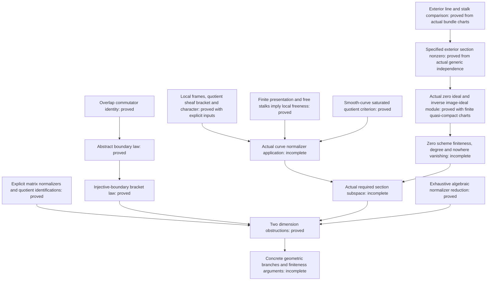

# Mathematical scope and proof dependencies

The formalized obstruction is a local algebraic endpoint of a proposed
geometric argument. The package also supplies general sheaf constructions
needed to connect the curve to that endpoint. Each theorem retains its
actual hypotheses; the missing geometric interfaces are not axioms.

## The algebraic obstruction

The scalar-action character is defined by `[x,m] = λ(x)m`. On overlaps,
the commutator of two lifts has the difference required for

```text
∂[x,y] = λ(x)∂y − λ(y)∂x.
```

When the relevant linear boundary map is injective, this implies
`[x,y] = λ(x)y − λ(y)x`. The abstract proof does not construct a curve's
cohomology connecting map.

For the semisimple representative `diag(1,1,−2)`, the quotient character
vanishes and the quotient is the `sl₂` model. A three-dimensional subspace
would be the whole quotient, but the boundary law would force all of its
brackets to vanish.

For the minimal-nilpotent representative `E₁₂`, the quotient has coordinates
`D,H,P,Q`. The law forces specific two-by-two coordinate minors to vanish.
Case analysis gives an injective projection to two coordinates, hence
dimension at most two. This proof obtains the obstruction directly; it
does not export a classification of all abelian planes.

`Matrices.lean` proves the normalizer equations in both directions.
`Quotients.lean` proves that the coordinate projections have exactly the
distinguished line as kernel and preserve commutators. Thus the coordinate
models are identified with the actual matrix quotients.

The later `TracelessNormalizer` and `MatrixScalarExtension` results prove
exhaustive algebraic reduction and the obstruction for all nonzero traceless
3×3 matrices over characteristic-zero fields under their exact
boundary-lift hypotheses. The geometric construction of that boundary law
and its required section subspace is separate.

## How the parts fit



Arrows to an incomplete node identify work still required, rather than a
completed Lean composition. The following module groups supply the pieces:

| Modules | Proven role |
|---|---|
| `Boundary`, `HomologyBoundary`, `SheafBoundary` | Overlap identity, abstract homology connecting maps, and direct sheaf gluing under explicit vanishing hypotheses. |
| `Matrices`, `Quotients`, `SlTwo`, `Obstruction`, `Flagship` | Exact normalizers, actual quotient models, and the two dimension contradictions. |
| `ExtensionNaturality`, `ExtensionDimension` | Extension-map annihilation and linear dimension bounds with their stated inputs. |
| `FrameCharacter`, `LocalCharacterGluing`, `NormalizerSheaf`, `TrivializedCharacter` | Frame-independent character and normalizer constructions. |
| `SheafQuotientBracket`, `SheafQuotientLie`, `NormalizerKernel`, `NormalizerTensorKernel` and their support modules | Genuine local quotient lifts, descended Lie operations, and the kernel identification, including its tensor target. |
| `AffineQuotient`, `IntegralSheafTorsion` and the stalk/neighborhood modules | Affine quotient comparison, torsion-freeness transport, and finite free neighborhoods. |
| `LocallyFreeAssembly`, `StalkLocalFreeness` | Assembly into `IsLocallyFree` and the regular dimension-at-most-one torsion-free criterion. |
| `SheafCokernelFinitePresentation`, `FiniteBundlePresentation`, `SaturatedStalkQuotient`, `SmoothSchemeStalks` | Actual cokernel finite presentation, finite presentation from finite bundle charts, saturation and smooth-stalk regularity give the smooth-curve quotient criterion. |
| `ProperConstants`, `ScalarCharacter`, `ProperNormalizerCharacter` | Constancy of actual global regular functions under the stated properness or universal-closedness inputs, with actual scalar-character compatibility. |
| `NormalizerStalkIntegration`, `GeometricNormalizerObstruction` | Actual quotient-stalk bracket and character comparison; the generic obstruction under an actual ambient sl3 identification and its compatibility. |
| `ExteriorLineTrivialization`, `LocalFrameStalk`, `ExteriorStalkComparison` | Genuine bundle charts construct exterior-line charts, actual stalk bases and the canonical exterior-stalk equivalence with its pure-germ formula. |
| `ExteriorNonzero`, `DeterminantGenericNonzero` | Actual generic independence proves the specified exterior section has nonzero generic germ and is globally nonzero. |
| `SectionLocalEquation`, `SectionDualEvaluation`, `SectionEvaluationMono`, `SectionZeroDivisor` | Actual local equations and dual evaluation; generic nonzeroness proves regularity and monicity. |
| `SectionZeroIdeal`, `IdealSheafGluing`, `SectionZeroScheme`, `ZeroIdealUniqueness` | Actual global zero ideal and closed subscheme from finite quasi-compact charts, with exact chart restrictions and cover independence. |
| `SectionImageSheaf`, `DualTransport`, `LineBidual`, `SectionIdealBundle` | Actual image ideal module, its dual and canonical bidual comparison; the inverse module recovers the original line and specified section. |
| `DeterminantZeroDivisor` | Specialization to the actual specified determinant; exterior and dual charts are constructed from the original rank-n bundle charts. |

## Remaining geometric interfaces

1. **Actual curve input.** Instantiate the proved smooth-curve saturated
   quotient criterion on the actual representation-derived Lie bundle and
   saturated line. Finite presentation from genuine finite bundle charts,
   actual cokernel finite presentation, smooth-stalk regularity and
   saturation-to-torsion-freeness are now proved. No affine PID cover of
   a smooth curve is assumed.
2. **Curve normalizer.** Instantiate the Lie bundle, saturated line and
   local frames. Global-function constancy and its actual character
   compatibility are now proved under the stated geometric inputs.
   The proved local-freeness theorem for the
   quotient by a kernel does not automatically give local freeness of the
   kernel itself.
3. **Global boundary law.** In the `H⁰(E)=0` applications, the direct
   gluing theorem provides a route once the geometric inputs are supplied.
   The alternative general injective-boundary route requires the actual
   connecting map and its Čech comparison. These are different routes;
   neither may assume its desired bracket identity.
4. **Required generic section subspace.** Actual generic evaluation,
   scalar extension, bracket/character compatibility and exhaustive
   algebraic reduction are proved. Dimension preservation is proved given
   an actual free inclusion or genuinely trivialized subsheaf. Constructing
   that input from the curve's specified sections remains unfinished.
   The constructed exterior line and stalk comparison prove the specified
   determinant section nonzero from actual function-field independence.
   They do not prove it nonvanishing at every point.
5. **Finiteness.** Supply the concrete extensions, section estimates,
   Harder–Narasimhan and boundary inputs for the genus-five branches, then
   the family, Hodge-theoretic, arithmetic and propagation arguments for
   the claimed representations, including nonsemisimple ones.

The zero-subscheme and inverse image-ideal module constructions are now proved
under their explicit finite quasi-compact chart and integral-scheme inputs.
The section-preserving comparison concerns the actual specified section.
The next geometric lemma is that this zero scheme is finite over the field
on a proper integral curve. Actual degree theory and its comparison with
that finite zero scheme remain required for
[Stacks Lemma 33.44.12(2)](https://stacks.math.columbia.edu/tag/0B40).
No general bundled effective-Cartier-divisor/O(D) interface is claimed.
The [precise gap note](DEGREE_NONVANISHING_GAP.md) distinguishes this concrete
construction from divisor finiteness, Euler-characteristic comparison and
positivity, none of which has been assumed as a new hypothesis in the proofs.
The actual saturated evaluation subbundle and its degree zero, the rank-two
section estimate, and the complete bound `h⁰(E/M) ≤ 4` remain unformalized.

## Claim boundary

| Statement | Status |
|---|---|
| Listed Lean theorems with their displayed hypotheses | **FORMALIZED** |
| Complete normalizer proposition for the actual curve | **PARTIAL formalization** |
| Landesman–Litt strict range `r < sqrt(g+1)` | **PUBLISHED**; not formalized by this package |
| Equality endpoint `r² ≤ g+1` | **CANDIDATE** |
| Rank three for `g ≥ 5` | **CANDIDATE** |
| Rank three in genus four | **CANDIDATE conditional on B1–B5** |
| Rank three in genus three; general `g ≥ r²−4` | **OPEN** |

A successful build checks the stated formal propositions. It does not
establish missing geometric hypotheses, independent mathematical review,
or a complete solution of the minimum-rank problem.
